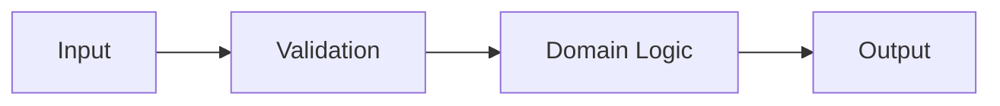

# Feature Design: <title>

## Metadata

- Task ID:
- Complexity: L1 / L2 / L3
- Status: DESIGN
- Created:
- Design approved by:
- Design approved at:

## 1. Problem

What problem are we solving?

## 2. Goal

What outcome should be achieved when this is done?

## 3. Non-goal

What is explicitly out of scope this time?

## 4. Existing behavior

How does the system currently work? What are the relevant code paths, interfaces, and constraints?

## 5. Reuse candidates

| Existing component | Location | Reuse? | Reason |
|---|---|---|---|

## 6. Proposed design

### Components and responsibilities

| Component | Responsibility | New / Changed |
|---|---|---|

### Functions

| Function | Responsibility | Input / Output | Estimated effective lines |
|---|---|---|---:|

By default, functions should not exceed 40 lines of effective logic.

### Data flow

### Error flow

Describe how validation errors, domain errors, and external errors propagate and are handled.

## 7. Files in scope

### Add

### Modify

### Delete

Files not listed here are, in principle, out of scope this time.

## 8. Test strategy

| Test | Level | Scenario | Expected result |
|---|---|---|---|

Consider at least:

- normal case
- boundary case
- failure case
- regression case

## 9. Minimal solution

What is the smallest, safest solution? Why is a more complex abstraction unnecessary?

## 10. Risks / Trade-offs

## 11. Open questions

## 12. Implementation plan

## 13. 40-line exception

Write `None` when there is no exception.

If there is an exception, list the function name and the specific reason for not splitting it.

## 14. Approval

Status: PENDING

Approval command:

`/design-gate:approve-design <task-id>`
